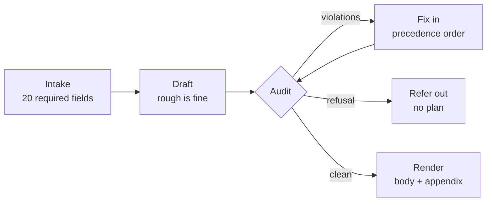

<h1 align="center">Trainer</h1>

<p align="center">
<b>A training and eating plan that gets argued with before you see it.</b><br>
No API key. No account. No subscription. No network. Runs on your laptop, offline.
</p>

<p align="center">
<code>Python 3.8+</code> · <code>zero dependencies</code> · <code>67 tests</code> · <code>MIT</code>
</p>

---

## The problem

Ask any AI for a training and diet plan and you get something that looks right.

| What you get | What's actually wrong |
|---|---|
| Confident numbers | Nothing checked them |
| "Personalised" | Your name at the top, the same plan underneath |
| Sensible-sounding meals | Macro-perfect combinations nobody would eat |
| A 12-week programme | With no deload in it |
| Advice on your weak point | That no food or supplement can actually change |

The failure is not that it's wrong. It's that **nothing can tell you it's wrong.**
You find out in week 14.

---

## The idea

> **Make the plan able to fail.**

Write the plan, then hand it to code that knows what a plan *for you* should look
like, and let it try to break it. Fix what it finds. Repeat until nothing breaks.

You never see draft one.

---

## It caught these in its own output

Not hypotheticals. Real defects, in plans that had already been written and handed over.

| # | What passed every "looks right" test | What it actually cost |
|---|---|---|
| 1 | Sabji costed at 1 tsp of oil; a real kitchen uses 3 | **210 kcal/day** — half the fat loss, silently |
| 2 | Two roti, boiled eggs, raw salad | Macro-perfect. Nobody eats dry roti |
| 3 | Glutes listed as a top priority | Trained 10 sets against a 12-set floor |
| 4 | Five sessions, 60-minute budget | Four of them needed **71–78 minutes** |
| 5 | Diet break week 12, deloads weeks 11 and 18 | Maintenance calories during a *hard* week |
| 6 | One BMR formula for everyone | **166 kcal/day** too high for every woman |
| 7 | Whey between meals, milk after training | Fast and slow protein in each other's jobs |
| 8 | Its own ranking comparator | Rated "broke food safety" an improvement on "a bit dull" |

Every one is now a test. None can come back.

---

## Same code, two people

No branches, no templates. One engine, two profiles in, two different plans out.

| | **A** · man, 30, 80 kg | **B** · woman, 52, 68 kg |
|---|---|---|
| Daily energy | 2,695 kcal | 1,795 kcal |
| Protein | 152–168 g | 129–143 g |
| Protein per sitting | 32 g | 27 g |
| Weekly sets per muscle | 10–22 | 6–14 |
| Deload every | 8 weeks | 5 weeks |
| Diet break | week 12 | week 8 |
| Max weekly loss | 0.6 kg | 0.51 kg |
| Movements excluded | 7 | 3 |
| Cost of one set | 200 s (shared gym) | 240 s (busy gym) |

Sex, age, sleep, training age, gym traffic, climate and injury all move the
numbers. **Nothing is a default.**

---

## How it works



It will not run on a guess. Twenty things about you are required and the gate
**raises, it doesn't warn** — because a guessed field is a silent error that
surfaces weeks later.

### The precedence ladder

A lower rung may never be satisfied by breaking a higher one. Enforced in code,
not left to whoever is editing the plan.

```
 0  refusal        life stage · contraindicated movement · equipment you don't have
 1  safety         food held past its limit for that temperature and storage
 2  floor          protein · fat · fibre · priority volume · loss rate · deload
 3  energy         session over budget · macros that don't sum
 4  coherence      a carrier with nothing wet · two heavy lifts back to back
 5  distribution   too few sittings reach the protein dose
 6  variety        the same thing every single day
 7  palatability   a meal or session you won't keep doing
        ▲
        └── enjoyment can never buy a food-safety exception, at any price
```

---

## Start here

### With Claude — no terminal

```
~/.claude/skills/trainer/
```

Drop the repo there and ask: *"build me a training and diet plan."*

Claude reads `SKILL.md`, runs the intake, drafts, audits, fixes, re-runs, and
hands you the document. Your answers go to `profiles/private-you.json`, which
git ignores.

### Yourself

```bash
python3 audit.py  --profile profiles/example-a.json --plan plans/example-a.json
python3 render.py --profile profiles/example-a.json --plan plans/example-a.json \
                  --out example-a-plan.md
python3 -m unittest discover -p 'test_*.py'
```

`0` clean · `1` violations · `2` refusal

---

## What you end up with

**Front page — what you do.** The week's training. The day's food, with household
quantities. Supplements and timing. The 24-week calendar. What to measure, and
the trigger that changes the plan.

**Back — why.** Every number's derivation, evidence tiers, hormone factors,
referrals, and standing answers to the claims you'll hear.

The split is enforced. A test fails the build if the front page contains
*"because"*, *"evidence"* or *"the reason"*. **Print the front. The back is for
when you want to argue.**

---

## "Yes, but —"

<table>
<tr><td width="34%"><b>Another AI fitness app?</b></td>
<td>No model, no API, no account, no network call. It's arithmetic and rules you can read in an afternoon.</td></tr>

<tr><td><b>Is it safe?</b></td>
<td>Refuses four life stages outright. Safety outranks everything but a refusal. Returns referrals for things a plan can't fix, instead of planning around them.</td></tr>

<tr><td><b>Will it just agree with me?</b></td>
<td>It can't. Twelve phrases — <code>spot reduce</code>, <code>boosts testosterone</code>, <code>detox</code>, <code>melts fat</code> — are blocked by a scanner. Nineteen common claims ship with verdicts and confidence tiers.</td></tr>

<tr><td><b>Is it actually personalised?</b></td>
<td>See the table above. Two people, one codebase, and every number differs.</td></tr>

<tr><td><b>Do I need to code?</b></td>
<td>No. That's what <code>SKILL.md</code> is for.</td></tr>

<tr><td><b>Where does my data go?</b></td>
<td>Nowhere. No network access exists in the code. Anything named <code>private-*</code> is gitignored. Four tests assert no individual's details appear anywhere in the engine.</td></tr>

<tr><td><b>Will it work for my food?</b></td>
<td>Nothing in the code names a cuisine, brand or machine. Region and gym live in <code>data/*.json</code>. A vegan in Lagos needs a new data file, not a new engine.</td></tr>
</table>

---

## It says no

**Refuses and refers out:** under 18 · pregnant · under 12 weeks postpartum ·
65+ without medical clearance.

**Won't claim, ever:** that any food, supplement or meal timing removes fat from
one part of your body, grows one muscle, or raises testosterone in someone whose
level is normal. None of those exist.

**Weak evidence is never an instruction.** It enters as a dated test with a
measurement and a kill date, or it doesn't enter.

---

<div align="center"><b>For developers</b></div>

---

## Why one engine and not two

Training and eating constrain each other.

```
deficit → recovery capacity → deload interval → block calendar → what you eat that week
```

Built apart, the halves contradict. An earlier version put the diet break at week
12 and training deloads at weeks 11 and 18 — maintenance calories during a hard
week, a deficit through an easy one. Neither half could see it alone.

## Layout

| File | Holds |
|---|---|
| `physio.py` | Energy, protein, recovery, volume, injuries, endocrine, the intake gate |
| `coherence.py` | Whether a meal is a meal and a session is doable |
| `blocks.py` | The 24-week calendar, and the rule that eating follows training |
| `contract.py` | The 23 sections a finished plan must contain |
| `myths.py` | Standing answers with tiers; claims that may never ship |
| `resolve.py` | Precedence order and the staged agent/challenger loops |
| `audit.py` · `render.py` | Run every check · write the document |
| `SKILL.md` | How Claude drives all of it |
| `data/` | Region and gym. Swap the file, not the code |

## Constraint checks vs completeness checks

Every early check asked *is this number legal*. None asked *is this section
present*. So violations were caught and **omissions were not** — supplements
vanished between drafts, post-workout feeding was never addressed, the warm-up
and progression rule were never written down. Each was found by a human reader,
one at a time.

`contract.py` is the fix: 23 required sections, each with a test that removes it
and asserts the plan becomes undeliverable. **Prose does not fail a build.**

## Loops that can't spin

`resolve.py` settles one rank, freezes it, moves down. A later stage cannot reach
backwards into an earlier one. Every round must strictly improve; a lateral move
is refused, because two agents trading the same violation is how you get a
ping-pong. Work is bounded by `ranks × cap` regardless of agent behaviour.

Six tests cover it: oscillating agents, a no-op agent, an impossible constraint,
a surviving soft violation, a runaway agent against the cap, and the lateral-move
refusal.

## Tests

```bash
python3 -m unittest discover -p 'test_*.py'   # 67
```

Most exist because something shipped broken.

## Limits

- Body fat is estimated from a tape measure. Every body-composition statement inherits that error.
- No alcohol, eating out, or social meals.
- No medication or condition layer — thyroid, insulin resistance and several common drugs change everything here, and the engine is blind to all of them.
- Palatability scores are estimates until you replace them with your own.

---

<p align="center">
<b>Not medical advice.</b><br>
A tool that checks arithmetic is not a doctor, a dietitian, or a coach.<br>
If something hurts, or a number here contradicts one you were given by a clinician, the clinician wins.
</p>
